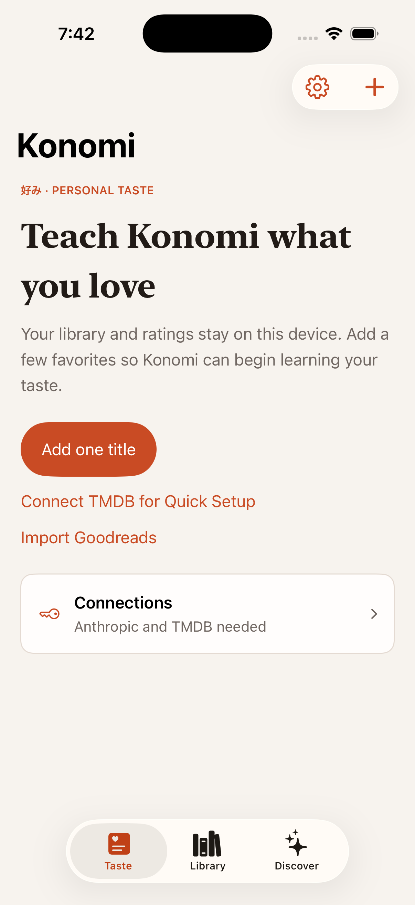

# Konomi

Konomi is an on-device iOS media tracker that learns from a person's own ratings and uses Claude to recommend books, films, and television they may love—even when public consensus disagrees.

> Portfolio snapshot from August 2026. The source is published for technical review; the production repository and live development history remain private.



## What to inspect

- [`ClaudeService.swift`](Konomi/Services/ClaudeService.swift) and [`TasteAnalysisService.swift`](Konomi/Services/TasteAnalysisService.swift) — explicit model budgets, prompt contracts, defensive JSON recovery, and lossy response filtering.
- [`PersistenceBootstrap.swift`](Konomi/Services/PersistenceBootstrap.swift) and [`PersistenceHygieneTests.swift`](KonomiTests/PersistenceHygieneTests.swift) — a non-destructive SwiftData startup boundary with retryable failure.
- [`MediaItemDeletionStore.swift`](Konomi/Services/MediaItemDeletionStore.swift), [`RecommendationDismissalStore.swift`](Konomi/Services/RecommendationDismissalStore.swift), and [`UndoTests.swift`](KonomiTests/UndoTests.swift) — reversible destructive actions backed by value snapshots and rollback-aware saves.
- [`TasteContourView.swift`](Konomi/Views/Components/TasteContourView.swift) and [`KonomiTheme.swift`](Konomi/Utilities/KonomiTheme.swift) — a product-specific SwiftUI visual system rather than stock card-grid styling.

## Engineering shape

- SwiftUI application with SwiftData persistence and no application backend.
- User-supplied Anthropic, TMDB, and optional Google Books keys stored in the iOS Keychain.
- Raw HTTP clients built with `URLSession` and `URLComponents`; no third-party dependencies.
- Goodreads import, local cover caching, deterministic UI-test fixtures, and explicit persistence recovery.
- AI-generated profiles and recommendations are replaceable snapshots, not an opaque history.

See [ARCHITECTURE.md](ARCHITECTURE.md) for boundaries and trade-offs and [USER_GUIDE.md](USER_GUIDE.md) for the product flow.

## Build and test

Requirements: Xcode 26.2 or newer and an iOS 26.2 simulator.

```sh
xcodebuild -project Konomi.xcodeproj -scheme Konomi \
  -destination 'generic/platform=iOS Simulator' build

xcodebuild -project Konomi.xcodeproj -scheme Konomi \
  -destination 'id=<KONOMI_SIMULATOR_UDID>' test
```

The app launches without credentials. Search and AI generation require the user to enter their own service keys in Settings; no keys are bundled with this repository.

The exported snapshot was verified on an iPhone 17 Pro simulator: 45 unit and UI tests passed.

## Privacy and license

Library data stays on the device. Network requests occur only for explicit metadata search, imports, cover lookup, or Claude features. Review [SECURITY.md](SECURITY.md) before reporting a potential disclosure.

This is source-available portfolio code, not an open-source project. See [LICENSE](LICENSE).
